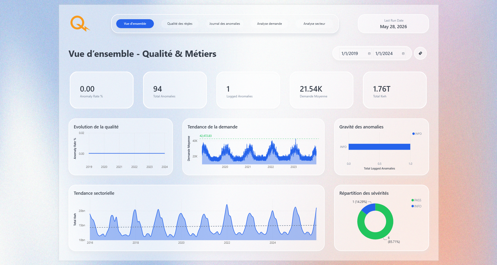
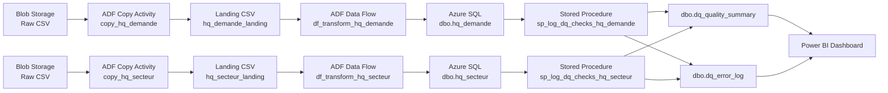
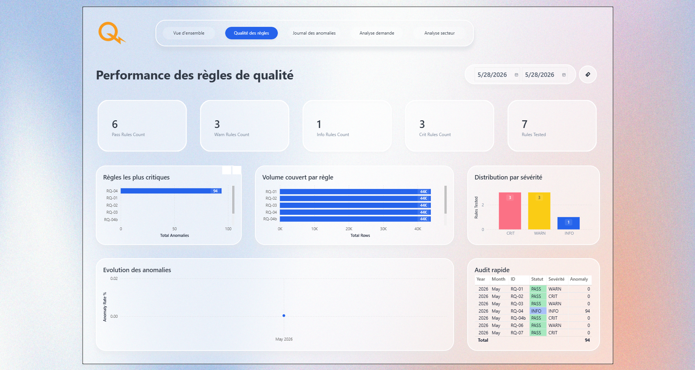
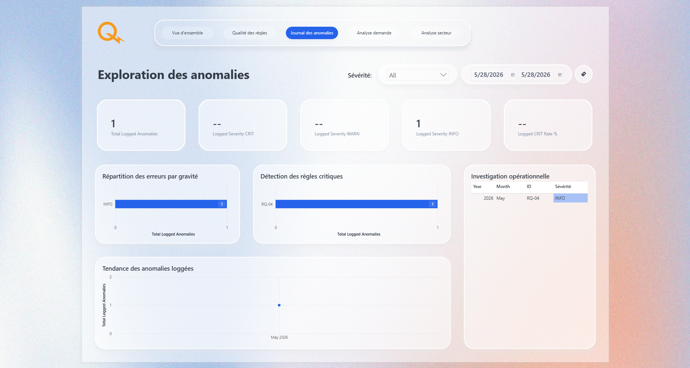
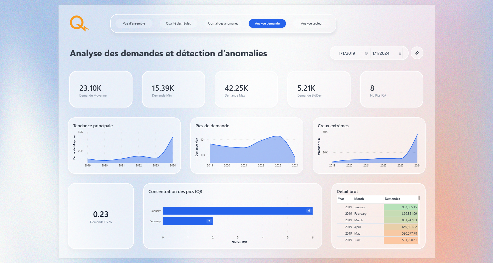
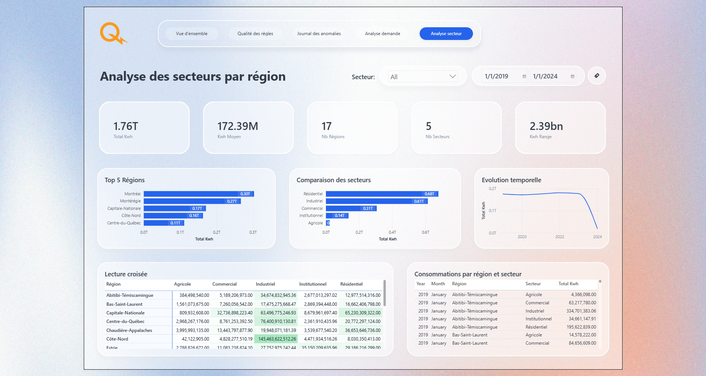

# Cadre de gouvernance et qualité des données - Hydro-Québec

Projet de gouvernance et de qualité des données construit autour de SQL, Power BI, Azure Data Factory, Databricks et Azure Blob Storage.



## Aperçu

Ce projet met en place un cadre complet de gouvernance et de qualité des données pour deux jeux de données Hydro-Québec :
- [la demande électrique horaire](https://donnees.hydroquebec.com/explore/dataset/demande-electricite-quebec/information/);
- [la consommation mensuelle par secteur](https://donnees.hydroquebec.com/explore/dataset/historique-consommation-secteur-activite-ra-mois/information/).

L'objectif est de détecter les anomalies, documenter les règles métier, automatiser les contrôles de qualité et produire des indicateurs exploitables dans Power BI.

## Architecture



## Pipeline Azure

Le pipeline principal `pl_hq_governance_ingestion` exécute :
1. une activité Copy pour la table demande;
2. une activité Data Flow pour la transformation;
3. une stored procedure pour journaliser les contrôles qualité;
4. la même logique pour la table secteur.

Les configurations Azure Data Factory sont versionnées dans `azure-adf/` et les artefacts ARM dans `adf-dgq-hq/`.

## Dashboard Power BI

Le dashboard de gouvernance est composé de 5 pages interconnectées via une table de dates commune `DimDate`.

| Page                  | Tables utilisées         | Objectif                                          |
| --------------------- | ------------------------ | ------------------------------------------------- |
| Vue d'ensemble        | Toutes                   | État global de la qualité et des métriques métier |
| Qualité des règles    | `dq_quality_summary`     | Analyse des règles par sévérité et statut         |
| Journal des anomalies | `dq_error_log`           | Détail des anomalies loggées par règle            |
| Analyse demande       | `hq_demande` + `DimDate` | Tendances et pics de la demande électrique MW     |
| Analyse secteur       | `hq_secteur` + `DimDate` | Consommation kWh par région et secteur            |

### Aperçu des pages

**Page 1 - Vue d'ensemble**


**Page 2 - Qualité des règles**


**Page 3 - Journal des anomalies**


**Page 4 - Analyse demande**


**Page 5 - Analyse secteur**


> Le fichier `.pbix` est disponible dans `dashboard/hq_gouvernance_dashboard.pbix`.

## Résultats principaux

- **43 818 lignes** chargées dans `dbo.hq_demande` après nettoyage et dédoublonnage.
- **10 200 lignes** chargées dans `dbo.hq_secteur` après normalisation.
- **7 règles de qualité** exécutées, historisées et tracées dans `dq_quality_summary`.
- **0 anomalie critique** détectée - toutes les règles CRIT sont à statut `PASS`.
- **2 corrections automatiques** appliquées par ADF : interpolation linéaire (RQ-01) et dédoublonnage (RQ-03).
- **1 observation documentée** conservée volontairement : 94 pics IQR légitimes (RQ-04).
- **Dashboard Power BI livré** avec 5 pages de gouvernance et d'analyse métier.
- **Suivi des anomalies** documenté dans Jira (5 tickets) et Confluence (3 pages).
- Dictionnaire de données versionné (`v1.1`) et règles de qualité versionnées (`v1.2`).
- Runbook opérationnel disponible dans `docs/runbook_pipeline.md`.

## Livrables

### Données
- `data/raw/` : fichiers bruts CSV.
- `data/clean/` : fichiers nettoyés CSV.

### Notebooks
- `notebooks/01_exploration.ipynb` : exploration initiale des données.
- `notebooks/02_quality_rules.ipynb` : règles de qualité et contrôles.

### Documentation
- `docs/dictionnaire_donnees/dictionnaire_donnees_v1_1.md`
- `docs/regles_qualite/regles_qualite_v1_2.md`
- `docs/runbook_pipeline.md`

### SQL
- `sql/create_dq_tables.sql`
- `sql/quality_check.sql`
- `sql/sp_log_dq_checks_hq_demande.sql`
- `sql/sp_log_dq_checks_hq_secteur.sql`

### Azure Data Factory
- `azure-adf/pipeline/pl_hq_governance_ingestion.json`
- `azure-adf/dataflow/df_transform_hq_demande.json`
- `azure-adf/dataflow/df_transform_hq_secteur.json`
- `azure-adf/dataset/*.json`
- `azure-adf/linkedService/*.json`

### Déploiement ADF
- `adf-dgq-hq/ARMTemplateForFactory.json`
- `adf-dgq-hq/ARMTemplateParametersForFactory.json`
- `adf-dgq-hq/globalParameters/`
- `adf-dgq-hq/linkedTemplates/`

### Reporting
- `reports/anomalies_log.csv`
- `reports/profil_hq_demande.csv`
- `reports/profil_hq_secteur.csv`
- `reports/quality_summary.csv`
- `dashboard/hq_gouvernance_dashboard.pbix`
- `dashboard/screenshots/` : captures d'écran des 5 pages du dashboard

## Modèle de données

### Tables métier
- `dbo.hq_demande` - demande électrique horaire (43 818 lignes, 2019–2024)
- `dbo.hq_secteur` - consommation mensuelle par secteur (10 200 lignes, 2016–2025)

### Tables de gouvernance
- `dbo.dq_error_log` - journal des anomalies détectées
- `dbo.dq_quality_summary` - résumé d'exécution par règle

### Modèle Power BI
- `DimDate` - table de dates commune reliée à `hq_demande` et `hq_secteur` (relation 1:*)

## Règles de qualité

Les contrôles appliqués couvrent :
- les valeurs nulles;
- les doublons;
- la convertibilité des dates;
- les valeurs extrêmes;
- les valeurs techniquement impossibles;
- la conformité des valeurs de secteur;
- la complétude et la positivité des mesures;
- la cohérence temporelle entre les deux tables.

### Résultats de qualité

| Règle  | Contrôle                                      | Sévérité | Statut final               | Anomalies      |
| ------ | --------------------------------------------- | -------- | -------------------------- | -------------- |
| RQ-01  | Complétude de `demande_mw`                    | `WARN`   | `PASS après correction`    | 45 à 0         |
| RQ-02  | Convertibilité de `date`                      | `CRIT`   | `PASS`                     | 0              |
| RQ-03  | Unicité des timestamps                        | `WARN`   | `PASS après correction`    | 6 à 0          |
| RQ-04  | Valeurs extrêmes IQR                          | `INFO`   | `INFO`                     | 94 (conservés) |
| RQ-04b | Valeurs techniquement impossibles > 45 000 MW | `CRIT`   | `PASS`                     | 0              |
| RQ-06  | Conformité des valeurs de `secteur`           | `WARN`   | `PASS après normalisation` | 0              |
| RQ-07  | Complétude et positivité de `total_kwh`       | `CRIT`   | `PASS`                     | 0              |
| RQ-08  | Cohérence temporelle entre les deux tables    | `INFO`   | `PASS`                     | -              |

## Technologies utilisées

- Azure SQL Database
- Azure Data Factory
- Azure Blob Storage
- Databricks
- Power BI
- SQL Server / T-SQL
- Python
- Jupyter Notebook
- Jira / Confluence
- Git / GitHub

## Exécution

### Prérequis
- Un compte Azure.
- Une base Azure SQL.
- Un espace Blob Storage avec les fichiers CSV sources.
- Azure Data Factory configuré et pipeline déployé.
- Power BI Desktop.

### Étapes
1. Charger les CSV bruts dans Azure Blob Storage.
2. Vider les tables de gouvernance si nécessaire (`TRUNCATE TABLE dbo.dq_error_log; TRUNCATE TABLE dbo.dq_quality_summary;`).
3. Exécuter le pipeline `pl_hq_governance_ingestion` dans ADF.
4. Vérifier le chargement dans `dbo.hq_demande` et `dbo.hq_secteur`.
5. Consulter les résultats dans `dbo.dq_error_log` et `dbo.dq_quality_summary`.
6. Actualiser le dataset Power BI et consulter le dashboard.

> Pour les détails complets de chaque étape, consulter le [Runbook pipeline](docs/runbook_pipeline.md).

## Structure du projet

```text
│   .gitignore
│   README.md
│           
├───adf-dgq-hq
│   │   ARMTemplateForFactory.json
│   │   ARMTemplateParametersForFactory.json
│   │   
│   ├───globalParameters
│   │       adf-dgq-hq_GlobalParameters.json
│   │       
│   └───linkedTemplates
│           ArmTemplateParameters_master.json
│           ArmTemplate_0.json
│           ArmTemplate_master.json
│           
├───azure-adf
│   │   publish_config.json
│   │   
│   ├───dataflow
│   │       df_transform_hq_demande.json
│   │       df_transform_hq_secteur.json
│   │       
│   ├───dataset
│   │       ds_hq_demande_landing.json
│   │       ds_hq_demande_raw.json
│   │       ds_hq_secteur_landing.json
│   │       ds_hq_secteur_raw.json
│   │       ds_sql_hq_demande.json
│   │       ds_sql_hq_secteur.json
│   │       
│   ├───factory
│   │       adf-dgq-hq.json
│   │       
│   ├───linkedService
│   │       ls_azure_sql.json
│   │       ls_blob_storage.json
│   │       ls_key_vault.json
│   │       
│   └───pipeline
│           pl_hq_governance_ingestion.json
│           
├───dashboard
│   │   data-gouvernance-hq-dashboard_pbi.pbix
│   │   
│   └───screenshots
│           01_vue_ensemble.png
│           02_qualite_regles.png
│           03_journal_anomalies.png
│           04_analyse_demande.png
│           05_analyse_secteur.png
│           
├───data
│   ├───clean
│   │       hq_consommation_secteur_clean.csv
│   │       hq_demande_electricite_clean.csv
│   │       
│   └───raw
│           hq_consommation_secteur_raw.csv
│           hq_demande_electricite_raw.csv
│           
├───docs
│   │   runbook_pipeline.md
│   │   
│   ├───dictionnaire_donnees
│   │       dictionnaire_donnees_v0_1.md
│   │       dictionnaire_donnees_v0_5.md
│   │       dictionnaire_donnees_v1_0.md
│   │       dictionnaire_donnees_v1_1.md
│   │       
│   ├───regles_qualite
│   │       regles_qualite_v0_1.md
│   │       regles_qualite_v0_5.md
│   │       regles_qualite_v1_0.md
│   │       regles_qualite_v1_1.md
│   │       regles_qualite_v1_2.md
│   │       
│   └───screenshots
│           01_pl_hq_governance_ingestion.png
│           02_df_transform_hq_secteur.png
│           03_df_transform_hq_demande.png
│           04_jira.png
│           05_confluence.png
│           
├───notebooks
│       01_exploration.ipynb
│       02_quality_rules.ipynb
│       
├───reports
│       anomalies_log.csv
│       profil_hq_demande.csv
│       profil_hq_secteur.csv
│       quality_summary.csv
│       
└───sql
        create_dq_tables.sql
        quality_check.sql
        sp_log_dq_checks_hq_demande.sql
        sp_log_dq_checks_hq_secteur.sql
```

## Connaissances acquises

Ce projet a permis de développer des compétences clés en :
- formalisation et versionnement des règles métier;
- automatisation des contrôles qualité via ADF et procédures stockées;
- structuration d'un modèle de gouvernance multi-tables;
- historisation des anomalies et traçabilité complète;
- conception de dashboards Power BI de gouvernance avec modèle en étoile;
- suivi des anomalies dans Jira et documentation dans Confluence.

## Références

- Dictionnaire de données : `docs/dictionnaire_donnees/dictionnaire_donnees_v1_1.md`
- Règles de qualité : `docs/regles_qualite/regles_qualite_v1_2.md`
- Runbook pipeline : `docs/runbook_pipeline.md`
- Pipeline ADF : `azure-adf/pipeline/pl_hq_governance_ingestion.json`
- Données Hydro-Québec (demande) : https://donnees.hydroquebec.com/explore/dataset/demande-electricite-quebec/information/
- Données Hydro-Québec (secteur) : https://donnees.hydroquebec.com/explore/dataset/historique-consommation-secteur-activite-ra-mois/information/