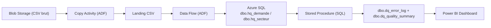

# Runbook - Pipeline de gouvernance des données Hydro-Québec

**Projet** : Cadre de gouvernance et qualité des données - Hydro-Québec

**Auteur** : Anthony MISSE

**Version** : 1.0

**Date** : 2026-05-29

**Statut** : Validé

***

## 1. Vue d'ensemble

Ce runbook décrit les procédures opérationnelles pour :

- relancer le pipeline ADF `pl_hq_governance_ingestion` ;
- vider les tables de gouvernance avant une nouvelle exécution ;
- vérifier les résultats après exécution ;
- interpréter les statuts de qualité dans Power BI.

Il s'adresse à toute personne amenée à maintenir, relancer ou auditer le pipeline de gouvernance des données Hydro-Québec.

***

## 2. Architecture du pipeline



Le pipeline principal `pl_hq_governance_ingestion` orchestre l'ensemble de ces étapes pour les deux tables métier en parallèle.

***

## 3. Prérequis

Avant toute opération, s'assurer que les éléments suivants sont en place :

| Prérequis          | Description                                                |
| ------------------ | ---------------------------------------------------------- |
| Compte Azure actif | Accès au groupe de ressources du projet                    |
| Azure Blob Storage | Fichiers CSV bruts disponibles dans le conteneur source    |
| Azure Data Factory | Pipeline `pl_hq_governance_ingestion` déployé et actif     |
| Azure SQL Database | Base de données cible accessible, tables créées            |
| Power BI Desktop   | Connecté aux tables `dq_quality_summary` et `dq_error_log` |

### Fichiers sources attendus dans Blob Storage

| Fichier                           | Table cible      |
| --------------------------------- | ---------------- |
| `hq_demande_electricite_raw.csv`  | `dbo.hq_demande` |
| `hq_consommation_secteur_raw.csv` | `dbo.hq_secteur` |

***

## 4. Étape 1 - Vider les tables de gouvernance

> **Important** : cette étape est obligatoire avant chaque relance complète du pipeline afin d'éviter les doublons dans les tables de log et de résumé.

### 4.1 Connexion à Azure SQL

Se connecter à la base Azure SQL via :
- Azure Data Studio, ou
- SQL Server Management Studio (SSMS), ou
- le Query Editor intégré dans le portail Azure.

### 4.2 Script de vidage

Exécuter les commandes dans cet ordre - `dq_error_log` en premier pour respecter les contraintes d'intégrité potentielles :

```sql
-- Étape 1 : vider les anomalies loggées
TRUNCATE TABLE dbo.dq_error_log;

-- Étape 2 : vider le résumé qualité
TRUNCATE TABLE dbo.dq_quality_summary;
```

> **Note** : si des contraintes de clé étrangère bloquent le `TRUNCATE`, utiliser `DELETE` à la place :

```sql
DELETE FROM dbo.dq_error_log;
DELETE FROM dbo.dq_quality_summary;
```

### 4.3 Vérification du vidage

```sql
SELECT COUNT(*) AS nb_error_log    FROM dbo.dq_error_log;
SELECT COUNT(*) AS nb_quality_summ FROM dbo.dq_quality_summary;
-- Résultat attendu : 0 dans les deux cas
```

***

## 5. Étape 2 - Relancer le pipeline ADF

### 5.1 Via le portail Azure (interface graphique)

1. Aller sur **portal.azure.com**.
2. Naviguer vers **Azure Data Factory** puis sélectionner la factory du projet.
3. Cliquer sur **"Lancer Azure Data Factory Studio"**.
4. Dans le menu gauche, cliquer sur **"Monitor"** (icône moniteur).
5. Sélectionner **"Pipeline runs"**.
6. Chercher le pipeline `pl_hq_governance_ingestion`.
7. Cliquer sur **"Trigger now"** (déclencher maintenant).
8. Confirmer le déclenchement sans paramètres supplémentaires.

### 5.2 Via Azure Data Factory Studio (mode auteur)

1. Aller dans **"Author"** (icône crayon).
2. Dans le panneau gauche, développer **"Pipelines"**.
3. Cliquer sur `pl_hq_governance_ingestion`.
4. Cliquer sur **"Add trigger"** puis **"Trigger now"**.
5. Confirmer.

### 5.3 Via PowerShell (automatisation)

```powershell
$resourceGroupName = "rg-hq-governance"
$dataFactoryName   = "adf-dgq-hq"
$pipelineName      = "pl_hq_governance_ingestion"

Invoke-AzDataFactoryV2Pipeline `
    -ResourceGroupName $resourceGroupName `
    -DataFactoryName   $dataFactoryName `
    -PipelineName      $pipelineName
```

### 5.4 Étapes internes du pipeline

Le pipeline exécute les activités suivantes dans l'ordre :

| Ordre | Activité                      | Rôle                                          |
| ----- | ----------------------------- | --------------------------------------------- |
| 1     | `copy_hq_demande`             | Copie le CSV brut vers le landing             |
| 2     | `df_transform_hq_demande`     | Nettoyage et chargement dans `dbo.hq_demande` |
| 3     | `sp_log_dq_checks_hq_demande` | Journalisation des contrôles qualité          |
| 4     | `copy_hq_secteur`             | Copie le CSV brut vers le landing             |
| 5     | `df_transform_hq_secteur`     | Nettoyage et chargement dans `dbo.hq_secteur` |
| 6     | `sp_log_dq_checks_hq_secteur` | Journalisation des contrôles qualité          |

***

## 6. Étape 3 - Relancer les procédures manuellement (optionnel)

Si le pipeline ADF s'est exécuté jusqu'aux tables métier mais que les procédures stockées doivent être relancées séparément :

```sql
-- Contrôles qualité sur hq_demande
EXEC dbo.sp_log_dq_checks_hq_demande;

-- Contrôles qualité sur hq_secteur
EXEC dbo.sp_log_dq_checks_hq_secteur;
```

> Cette commande peut être utilisée pour rejouer les contrôles sans recharger les données.

***

## 7. Étape 4 - Vérifier les résultats SQL

### 7.1 Vérification du résumé qualité

```sql
SELECT
    rule_id,
    table_name,
    severity,
    status,
    total_rows,
    anomaly_count,
    pct_anomalies,
    run_date
FROM dbo.dq_quality_summary
ORDER BY rule_id;
```

### 7.2 Résultats attendus (données actuelles du projet)

| `rule_id` | `table_name`   | `severity` | `status` attendu           | `anomaly_count` |
| --------- | -------------- | ---------- | -------------------------- | --------------- |
| RQ-01     | dbo.hq_demande | `WARN`     | `PASS après correction`    | 0               |
| RQ-02     | dbo.hq_demande | `CRIT`     | `PASS`                     | 0               |
| RQ-03     | dbo.hq_demande | `WARN`     | `PASS après correction`    | 0               |
| RQ-04     | dbo.hq_demande | `INFO`     | `INFO`                     | 94              |
| RQ-04b    | dbo.hq_demande | `CRIT`     | `PASS`                     | 0               |
| RQ-06     | dbo.hq_secteur | `WARN`     | `PASS après normalisation` | 0               |
| RQ-07     | dbo.hq_secteur | `CRIT`     | `PASS`                     | 0               |

> **Note RQ-04** : les 94 valeurs supérieures au seuil IQR (37 005.60 MW) sont des pics de demande légitimes concentrés en janvier-février 2022 et 2023, correspondant à des vagues de grand froid. Elles sont conservées volontairement.

### 7.3 Vérification du journal d'anomalies

```sql
SELECT
    rule_id,
    table_name,
    column_name,
    anomaly_type,
    anomaly_count,
    severity,
    action_taken,
    details
FROM dbo.dq_error_log
ORDER BY rule_id;
```

**Résultat attendu** : une seule ligne pour RQ-04 (outliers IQR conservés). Les autres règles ne doivent générer aucune entrée puisque les anomalies ont été corrigées en amont dans les Data Flows ADF.

### 7.4 Vérification du nombre de lignes dans les tables métier

```sql
SELECT COUNT(*) AS nb_demande FROM dbo.hq_demande;
-- Résultat attendu : 43 818 lignes (après dédoublonnage)

SELECT COUNT(*) AS nb_secteur FROM dbo.hq_secteur;
-- Résultat attendu : 10 200 lignes
```

***

## 8. Étape 5 - Interpréter les résultats dans Power BI

### 8.1 Actualiser le dataset

1. Ouvrir le fichier `.pbix` dans Power BI Desktop.
2. Cliquer sur **"Actualiser"** dans le ruban **"Accueil"**.
3. Attendre la fin de l'actualisation.
4. Vérifier que `Last Run Date` est mis à jour sur la page Vue d'ensemble.

### 8.2 Lecture des statuts

| Valeur de `status`         | Signification                                                       | Action requise                   |
| -------------------------- | ------------------------------------------------------------------- | -------------------------------- |
| `PASS`                     | Règle réussie dès le départ, aucune anomalie                        | Aucune                           |
| `PASS après correction`    | Anomalie détectée et corrigée automatiquement par ADF               | Aucune - surveiller la fréquence |
| `PASS après normalisation` | Valeurs non conformes normalisées par ADF                           | Aucune - surveiller la fréquence |
| `INFO`                     | Observation documentée, valeurs conservées volontairement           | Aucune - valeurs légitimes       |
| `FAIL`                     | Anomalie critique non corrigeable - pipeline potentiellement bloqué | Intervention immédiate requise   |

### 8.3 Lecture des sévérités

| Valeur de `severity` | Signification                               | Comportement pipeline                   |
| -------------------- | ------------------------------------------- | --------------------------------------- |
| `PASS`               | Contrôle réussi sans anomalie               | Pipeline continue normalement           |
| `INFO`               | Observation non bloquante                   | Pipeline continue, anomalie journalisée |
| `WARN`               | Anomalie mineure - corrigée automatiquement | Pipeline continue, correction appliquée |
| `CRIT`               | Anomalie bloquante - non corrigeable        | Pipeline arrêté si anomalie présente    |

### 8.4 Pages Power BI et ce qu'elles indiquent

| Page                  | Tables utilisées         | Question principale                                        |
| --------------------- | ------------------------ | ---------------------------------------------------------- |
| Vue d'ensemble        | Toutes                   | État global de la qualité et des métriques métier          |
| Qualité des règles    | `dq_quality_summary`     | Quelles règles ont échoué ou nécessité une correction ?    |
| Journal des anomalies | `dq_error_log`           | Quelles anomalies ont été loggées et avec quelle gravité ? |
| Analyse demande       | `hq_demande` + `DimDate` | Quelle est la tendance et la qualité de la demande MW ?    |
| Analyse secteur       | `hq_secteur` + `DimDate` | Quelle est la consommation par région et par secteur ?     |

***

## 9. Diagnostic des erreurs courantes

### 9.1 Le pipeline échoue sur le Copy Activity

**Symptôme** : l'activité `copy_hq_demande` ou `copy_hq_secteur` se termine en erreur.  
**Causes possibles** :
- Le fichier CSV n'est pas présent dans le conteneur Blob Storage.
- Le linked service vers Blob Storage a expiré (token SAS ou clé d'accès).
- Le nom du fichier source a changé.

**Action** : vérifier la présence du fichier dans Blob Storage et rafraîchir les credentials du linked service dans ADF.

***

### 9.2 Le pipeline échoue sur le Data Flow

**Symptôme** : le Data Flow `df_transform_hq_demande` ou `df_transform_hq_secteur` échoue.  
**Causes possibles** :
- Le schéma du CSV source a changé (colonnes renommées ou ajoutées).
- Le cluster Databricks sous-jacent au Data Flow est arrêté ou mal configuré.
- La base Azure SQL est inaccessible (quota, pare-feu, connexion).

**Action** : vérifier les logs d'exécution dans ADF Monitor, contrôler l'état du cluster Databricks, vérifier les règles de pare-feu Azure SQL.

***

### 9.3 La procédure stockée insère des doublons

**Symptôme** : `dq_quality_summary` contient plusieurs lignes pour le même `rule_id`.  
**Cause** : les tables n'ont pas été vidées avant la relance.  
**Action** : exécuter le script de vidage de la section 4, puis relancer les procédures.

***

### 9.4 Power BI n'affiche pas les nouvelles données

**Symptôme** : les KPIs ne changent pas après une nouvelle exécution du pipeline.  
**Cause** : le dataset Power BI n'a pas été actualisé.  
**Action** : cliquer sur "Actualiser" dans Power BI Desktop, ou planifier une actualisation automatique dans Power BI Service.

***

### 9.5 `status = FAIL` apparaît dans le résumé

**Symptôme** : une ligne avec `status = 'FAIL'` est présente dans `dq_quality_summary`.  
**Règles concernées** : RQ-02 (dates non convertibles) ou RQ-04b (valeurs > 45 000 MW) ou RQ-07 (total_kwh nul ou négatif).  
**Action** :
1. Consulter `dq_error_log` pour identifier les lignes problématiques.
2. Vérifier le fichier CSV source pour comprendre l'origine des données incorrectes.
3. Corriger à la source ou adapter le Data Flow si le format a changé.
4. Ne pas relancer le pipeline avant correction.

***

## 10. Périodicité recommandée

| Action                                 | Fréquence recommandée                           |
| -------------------------------------- | ----------------------------------------------- |
| Relance complète du pipeline           | À chaque nouveau fichier CSV disponible         |
| Vérification de `dq_quality_summary`   | Après chaque exécution du pipeline              |
| Consultation du dashboard Power BI     | Après chaque actualisation du dataset           |
| Revue des règles de qualité            | Trimestrielle ou lors d'un changement de source |
| Mise à jour du dictionnaire de données | À chaque changement de schéma des tables        |

***

## 11. Références

- Règles de qualité : `../docs/regles_qualite/regles_qualite_v1_2.md`
- Dictionnaire de données : `../docs/dictionnaire_donnees/dictionnaire_donnees_v1_1.md`
- Pipeline ADF : `../azure-adf/pipeline/pl_hq_governance_ingestion.json`
- Procédure demande : `../sql/sp_log_dq_checks_hq_demande.sql`
- Procédure secteur : `../sql/sp_log_dq_checks_hq_secteur.sql`
- Script de création des tables : `../sql/create_dq_tables.sql`